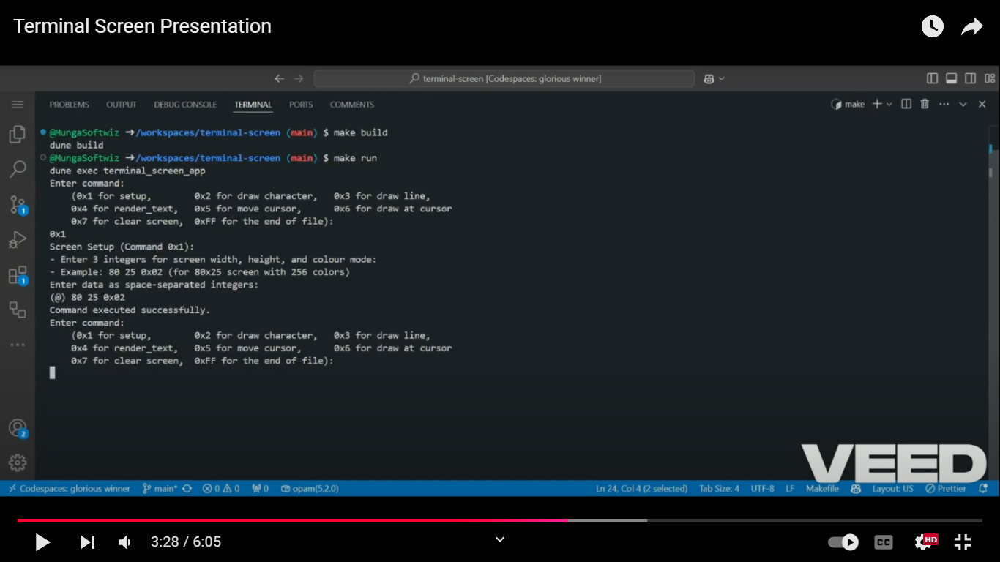

# terminal-screen (A Terminal Screen Renderer)


This project implements a terminal screen renderer using OCaml. It parses a stream of binary-encoded commands and renders graphical characters/text in a terminal. This is achieved by interpreting the commands to setup a virtual screen, draw characters, lines, and text, manipulate the cursor, and clear the screen.

# Glossary

- [Project Presentation](#project-presentation)
- [Interview Answers](#interview-answers)
- [Proposal adn UML Diagrams](#proposal-and-uml-diagrams)
- [Program Overview](#program-overview)
- [Features](#features)
- [Getting Started](#getting-started)
- [References](#references)

# Project Presentation

Click the link below to watch the project's presentation on YouTube.

<a href="https://www.youtube.com/watch?v=gGwpW5ToJHs" target="blank">
<p align="center">Watch Project's Video Demo</p>
<p align="center"></p>
</a>



# Interview Answers

In addition to the technical aspects of this project, I’ve also answered a few questions in an interview format to provide deeper insights into my computing interests and the person I would most like to meet. You can read the full interview answers [here](./docs/Interview-Answers.pdf).

---

# Proposal and UML Diagrams

- Below are the links to the proposal and corresponding UML Diagrams:

### Project's proposal

Below is the project's proposal in PDF format.

[Project Proposal (PDF)](./docs/Terminal-Screen-Initial-Proposal.pdf)

### Use Case Diagram

Below is the use case diagram in PDF format:

[Use Case Diagram (PDF)](./docs/Terminal-Screen-Use-Case-Diagram.pdf)

### Sequence Diagram

Below is the sequence diagram in PDF format:

[Sequence Diagram (PDF)](./docs/Terminal-Screen-Sequence-Diagram.pdf)

### Flowchart Diagram

Below is a flowchart diagram in PDF format:

[Flowchart Diagram (PDF)](./docs/Terminal-Screen-Flowchart-Diagram.pdf)

### MVP: Making Progress

This section outlines the progress of the project as of 9/12/2024. Below is the document in PDF format:

[MVP: Making Progress (PDF)](./docs/Terminal-Screen-MVP-Progress.pdf)

---

# Program Overview

This project leverages the power of OCaml's functional programming features to create a highly efficient and flexible terminal screen renderer. By utilising OCaml, the project benefits from strong type inference, immutability, and higher-order functions, ensuring robust and maintainable code.

### Key Highlights

- **Bresenham's Algorithm**: This project implements Bresenham's line algorithm to draw characters and lines accurately between coordinates. This algorithm is renowned for its efficiency in rendering lines on raster displays, making it ideal for text drawing in terminal screens. Efficiency is achieved using only integer addition, subtraction, and bit shifting to determine which points should be highlighted to form a close approximation to a straight line. Much faster than the floating-point arithmetic method.
- **ANSI Colours**: To enhance the visual appeal, the project uses ANSI escape codes to handle text colouring and highlighting. This allows for a customisable and visually engaging terminal interface, capable of displaying a wide array of colours and styles.
- **Functional Programming**: The use of OCaml's functional programming paradigms ensures that the code is concise, expressive, and easy to reason about. Functions are treated as first-class citizens, enabling powerful abstractions and code reusability. Check out this page if you want to learn more about [Ocaml's amazing features](https://www2.lib.uchicago.edu/keith/ocaml-class/why.html#:~:text=OCaml%20is%20basically%20as%20fast,static%20typing%20with%20type%20inference.).

# Features

- **Screen Setup**: Initialise a virtual terminal screen with customisable dimensions and colour modes.
- **Draw Characters**: Place individual characters at specific coordinates.
- **Draw Lines**: Render straight lines between two points with specified characters and colours.
- **Render Text**: Display strings of text starting at a given position.
- **Cursor Movement**: Move the cursor without rendering.
- **Screen Clearing**: Reset the screen content.
- **EOF Handling**: Terminate rendering upon receiving an end-of-file command.

---

### Binary Command Format

The program processes a binary input with the following structure:

| **Command Byte** | **Length Byte** | **Data Bytes**         |
| ---------------- | --------------- | ---------------------- |
| 1 byte           | 1 byte          | Depends on the command |

### Command Specifications

| **Command**    | **Code** | **Description**                               | **Data Format**                                             |
| -------------- | -------- | --------------------------------------------- | ----------------------------------------------------------- |
| Setup Screen   | `0x1`    | Initialise screen dimensions and colour mode. | `Byte 0`: Width, `Byte 1`: Height, `Byte 2`: Colour Mode    |
| Draw Character | `0x2`    | Draw a character at specific coordinates.     | `Byte 0`: x, `Byte 1`: y, `Byte 2`: Colour, `Byte 3`: ASCII |
| Draw Line      | `0x3`    | Draw a line between two coordinates.          | `Byte 0-4`: Coordinates, `Byte 5`: Colour, `Byte 6`: ASCII  |
| Render Text    | `0x4`    | Display text starting at a given position.    | `Byte 0-2`: Position & Colour, `Byte 3-n`: ASCII text       |
| Cursor Move    | `0x5`    | Move cursor to a specific position.           | `Byte 0`: x, `Byte 1`: y                                    |
| Draw at Cursor | `0x6`    | Draw at the current cursor position.          | `Byte 0`: ASCII, `Byte 1`: Colour                           |
| Clear Screen   | `0x7`    | Reset the screen.                             | No data                                                     |
| End of File    | `0xFF`   | End of the binary stream.                     | No data                                                     |

---

### Project Structure

```
terminal-screen/
├── README.md
├── bin/
|   ├── main.ml
├── lib/
│   ├── *.ml
│   ├── *.mli
├── test/
│   ├── test_module.ml
├── .gitignore
├── .ocamlformat
├── dune-project
├── library.opam
├── AUTHORS
└── Makefile
```

---

# Getting Started

### Installation

1. Clone the repository:

```bash
git clone https://github.com/yourusername/terminal-screen.git
cd terminal-screen
```

2. Install dependencies:

```bash
sudo apt-get install opam
```

3. Initialise OPAM:

```bash
opam init
eval $(opam env)
```

4. Install project's dependencies:

```bash
opam install . --deps-only -y
```

5. Activate the switch (environment):

```bash
eval $(opam env)
```

### Build the Program

- To build the program in an executable:

```bash
make build
```

### Running the Program

- To execute the program:

```bash
make run
```

### Running Tests

- Execute all unit tests:

```bash
make test
```

# References

This project was developed with the help of the following resources:

- [Official OCaml Documentation](https://ocaml.org/docs) for understanding the OCaml language and its standard library.
- [ANSI Escape Codes Documentation](https://en.wikipedia.org/wiki/ANSI_escape_code) for managing terminal graphics.
- [Github Gist of ANSI 256 colours](https://gist.github.com/HendrixStringed994b8a57563a9934bb90ca1fae2de5) for a guide to ANSI 256 colour codes. Contains a link to Stack Overflow threads on the same.
- [256 Colour Palette Explainer](https://abouris.github.io/color_explain/) webpage for the colour theory and ANSI colour visualisation.
- [Bresenham's Line Drawing Algorithm](https://www.geeksforgeeks.orgbresenhams-line-generation-algorithm/) to efficiently draw straight lines between two points on a grid.

# Authors

Made with ❤️ by Boniface Munga - [Github](https://github.com/MungaSoftwiz) / [X](https://X.com/MungaSoftwiz)
